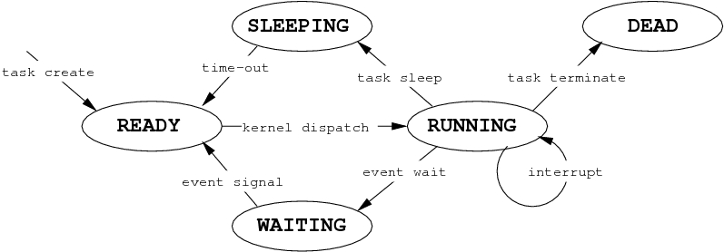

# mantOS

Author: Agustin Bassi - 2018

# Motivation

This project starts as academic project. Once the project was deliver, the RTOS worked really well, so it was decided to improve and make it publicly available.

Besides, it was intended to be implemented in a simple way importing four files to a project and compile it with the rest of application code.

Other and more complex RTOS like FreeRTOS or OSEK must be compiled with complex makefiles that make them difficult to use in beginners.

# Description

The project consists in a ultra-light real time operating system for ARM Cortex-M processors.

The RTOS consists in three parts:

1. An Assembler file called "PendSVHanler" used for switch context between tasks maintaining their states.
2. The RTOS files which are os_config.h, os.h and os.c.
3. The user application program which uses the RTOS in a really simple manner.

> **_NOTE:_**  This project has been builded within the [CIAA Project](http://www.proyecto-ciaa.com.ar/index_en.html) context. CIAA Project is an open source embedded platform oriented for industrial developments. Although of that, this RTOS can runs over any ARM Cortex-M microprocessor.

# Operating System description

This RTOS works in a preemtive way, this means that a task can be interrupted if there is a task with major priority ready to run (managed by the kernel).

To properly interrupt a task the kernel implements a mechanism to save each task context (stack pointer, variables, states and others) in order to resume the tasks later.

A task can be interrupted for two reasons: 
* A major priority task is ready to be executed.
* By timeout if there are other tasks with the same priority ready to execute, because the same priority tasks are executed in Round Robin way.

### IPC mechanism

To communicate with kernel system and to syncronize events and data between task, some common IPC (interprocess Communication Protocol) are implemented:

* Semaphore: This mechanisms serves to syncronize events between task. A semaphore can be taken by a task, then this semaphora can watched by another task waiting for this semaphore is released. In the meanwhile the tasks waiting for it will be paused and resumed once the semaphore is released.
* Mutex: This mechanisms serves to but they are used in resources related tasks. Also, mutex implement sailing priority, a mechanishm to not block higher priority tasks if some of less priotity take de mutex.
* Queue: This mechanisms serves to send data between tasks. The data is pushed into the queue and poped by another task.

> **_NOTE:_**: The IPC mechanisms are not been released yet, they are in feature/ipc branch. 

### Tasks states

The tasks states can be determined by the next enum.

```c
/** possible states of a task */
typedef enum TaskState {
    TASK_STATE_INVALID,
    TASK_STATE_READY,
    TASK_STATE_RUNNING,
    TASK_STATE_WAITING,
    TASK_STATE_ZOMBIE,
    TASK_STATE_TERMINATED
} TaskState_t;
```

To explain better the possible tasks states, in the figure below are shown the tasks flow.



# Using RTOS

The RTOS usage is shown in the main.c file. Starting by importing the os.h and os_config.h headers with the lines below.

Declare application tasks that must have the interfaces as follows.

```c
static void * Task1(void * param);
static void * Task2(void * param);

/* Stack for each task */
uint8_t StackFrame1[STACK_SIZE];
uint8_t StackFrame2[STACK_SIZE];

// Define each OS Task associaten them to a function, stack and priority
const TaskDefinition_t Os_TaskList[TASK_COUNT] = {
    {StackFrame1, STACK_SIZE, Task1, (void *)DEFAULT_TASK_PARAMS, TASK_PRIORITY_LOW},
    {StackFrame2, STACK_SIZE, Task2, (void *)DEFAULT_TASK_PARAMS, TASK_PRIORITY_MEDIUM},
};
```

Define application tasks putting relating code in each one.

```c
static void * Task1(void * param){
    // loops forever
    while (1) {
        Board_LED_Toggle(1);
        Os_Delay(140);
    }
    return (void *)DEFAULT_RETURN_VALUE; 
}

static void * Task2(void * param){
    // when this task finished to loop they won't be executed again
    int timesToLoop = TIMES_TO_LOOP;
    while (++timesToLoop) {
        Board_LED_Toggle(2);
        Os_Delay(650);
    }
    return (void *)DEFAULT_RETURN_VALUE; 
}
```

Call the system initialization in the setup process. Note that there are no code in the main loop. This is because the kernel is in charge to manage tasks and execute them in the desired way.

```c
int main(void){
    // Initialize the board HW
    Board_Init();
    // Start OS
    Os_Start();
    // The previous call must never comeback here
    while(1);
}
```

# Contributing

Do you like the project? Please, helpe with a STAR and Follow. It is important for me and animates me to continue working and contribuiting for the open source community.

Pull requests are welcome. For major changes, please open an issue first to discuss what you would like to change.

# License

[GPL]


